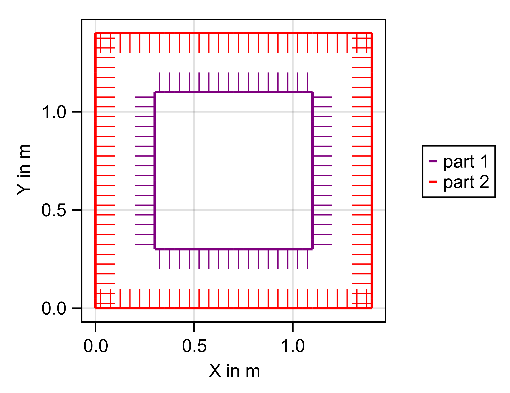
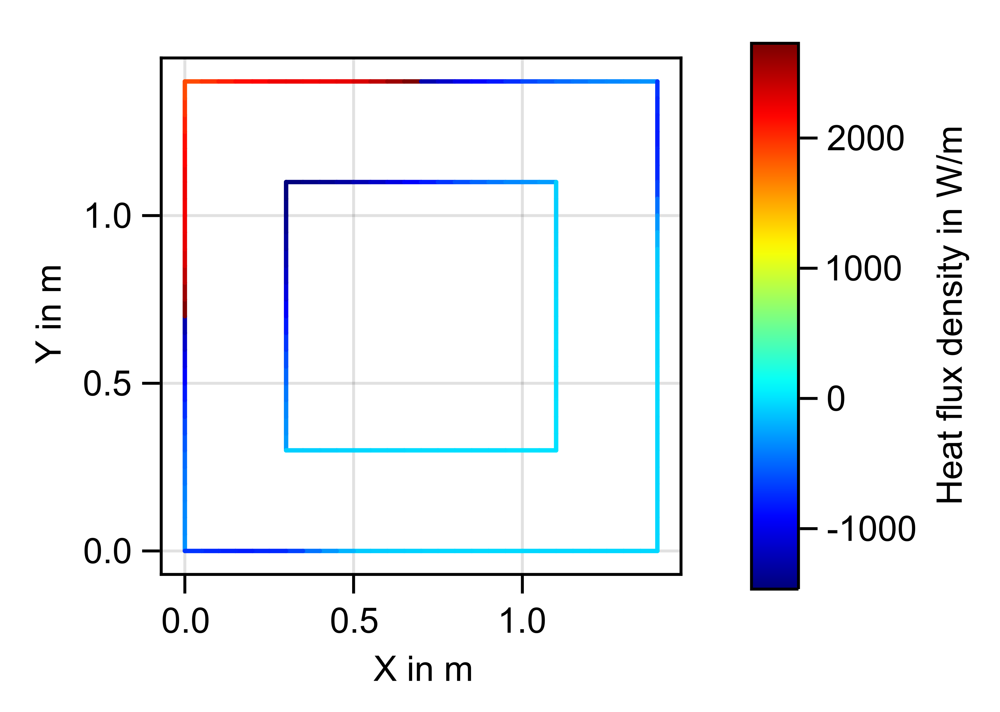

# RadMod2D

**Radiation modelling for two-dimensional geometries (RadMod2D)**

RadMod2D provides a model for calculating view factors of arbitrary two-dimensional surfaces. With these view factors the additional application of the net radiation method for calculating exchanged heat fluxes can be used.

With a set of basic tools like edges, circles etc arbitrary two dimensional geometries can be build and discretized. Complex geometries can be build externally and transfered into the model format. The view factor matrix for the model's elements get calculated with the area integration method and newly developed blocking algorithm. After applying boundary conditions for each element the heat fluxes due to radiation exchange can be calculated.

## Archived development status of paper submission

This is the archived development status of RadMod2D at submission of the paper.
Example and validation cases are presented in the following scripts:

- `test/run_cyl_in_cyl.jl` (chapter 3 and 4.1)
- `test/run_epseff_groove.jl` (chapter 4.2)
- `test/run_bf_vs_algo.jl` (chapter 4.3)
- `test/run_pinhole.jl` (chapter 4.4)
- `test/run_corridor.jl` (chapter 4.5)

_Future developments can lead to different results._
## Setup and Usage

RadMod2D is written in the [Julia programming language](https://julialang.org/).

> _Tested with julia 1.6.1_

> _All files should be run from within the project folder!_

> `./src` _contains the essential code of the model_

### Setup julia and package

1. Download and install [Julia](https://julialang.org/)
2. Open a Terminal
3. Setup enviroment
    1. Go to the folder of this project containing the `Project.toml` file.
    2. Open Julia
    3. Switch to package mode with  `]`
    4. In pkg mode activate current environment with `activate .`
    5. Use `instantiate` to install packages defined in the `Project.toml` file (first time only)
4. Check if RadMod2D is working properly
    1. Switch back to julia REPL mode (backspace) or open new terminal with julia
    2. Run script with `include("./test/run_test_vf.jl")`
    3. Check if RadMod2D is working properly with comparing analytical and numerical results of the calculation
### Run custom script

For using RadMod2D and ensuring the right enviroment start the script with:
```julia
using Pkg
Pkg.activate(".")
using RadMod2D
```
A collection of predefined models can be found in `test/models2D.jl`. One example is a small rectangle (r1) centered inside a bigger rectangle (r2):
```julia
include("./models2D.jl")
r1x = 0.8 # length of one side of r1
r1y = 0.8 # length of other side of r1
r2x = 1.2
r2y = 1.2
elemsize = 0.05 # element size used for discretization
m = model_rect_in_rect(r1x, r1y, r2x, r2y, elemsize)
```



The view factors for the discretized geometry get calculated with:
```julia
vfmat = zeros(Float64, m.nelem, m.nelem)
existing_vf!(m, vfmat)
n = 15
dx, dy = create_tiles(m, n)
t_occ = check_tile_occupation(m, dx, dy, n)
blocking_vf_with_tiles!(m, vfmat, dx, dy, n, t_occ)
calculating_vf!(m, vfmat, normit = true)
```

Afterwards the heat fluxes per element Q can be calculated with the net radiation method:
```julia
epsilon = zeros(m.nelem,1) # emissivities for elements
set_bc_part!(m, epsilon, 1, 0.3)
set_bc_part!(m, epsilon, 2, 0.6)
temp = zeros(m.nelem,1) # temperature boundary conditions per element
set_bc_part!(m, temp, 1:2, 300)
temp[79:106,1] .= 600 # temp bc for specific elements
Q, G = tempsolver(m, vfmat, temp, epsilon)
```

With the areas of the elements the heat flux density can be determined:
```julia
area = [m.elem[i].area for i = m.elem2par[1].first:m.elem2par[end].last]
q = Q[:] ./ area[:]
```


The plots are made with a plotting toolbox available at `test/plot2D.jl`. The examples are presented in in `test/run_example2.jl`.